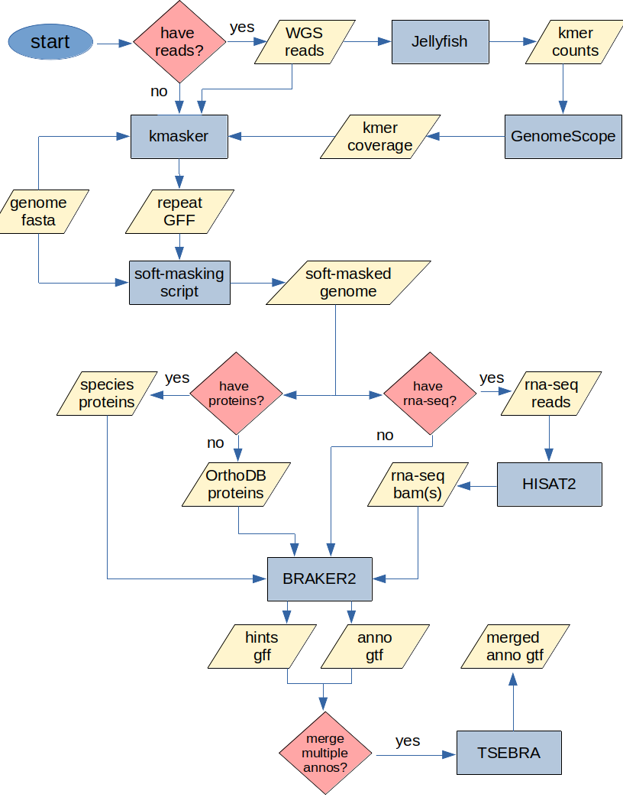

# kmer_masked_annotation
annotation pipeline based on kmasker and BRAKER

below are some notes regarding various components of the pipeline

# kmasker
- kmasker masks sequences using either genome or read-based kmer frequencies. Using reads is preferred as genome assemblers can collapse repeats into a single copy, which kmasker won't detect using genome-based kmer frequencies.
- The default kmasker frequency threshold is 10, though we've found 5(x) will produce good results without over-masking.

# GenomeScope
- If using reads, you'll need to determine the kmer frequency that represents 1x kmer coverage. This is accomplished by following the Jellyfish and GenomeScope sub-pipeline to determine the GenomeScope "kcov" value. For diploids, be sure to set GenomeScope's ploidy option to '2'. In this case, the kcov will represent the 1x haploid kmer coverage, which should be doubled to represent the 1x diploid kmer coverage.

# BRAKER
- BRAKER can be ran with either protein sequences and/or rna-seq, ideally both. (proteins and rna-seq should be processed by BRAKER individually and merged using TSEBRA)
- If you don't have (or have relatively few) closely-related protein sequences, BRAKER recommends using (or supplementing existing proteins with) OrthoDB proteins. (see BRAKER doc for full details) We tested BRAKER using ~300k closely-related proteins, ~3.5M OrthoDB Viridplantae proteins and the combined closely-related/OrthoDB set. In our tests, the closely-related protein set performed the best.

# TSEBRA
- If you have rna-seq in addition to protein-based annotations (and hint files), you may elect to merge the two sets. Be aware that TSEBRA produces an annotation file that is an intersection of the rna-seq and protein-based annotations, i.e. the output gtf will contain fewer genes than either input gtf.

# software links
[kmasker](https://github.com/tschmutzer/kmasker)
[Jellyfish](https://github.com/gmarcais/Jellyfish)
[GenomeScope](https://github.com/tbenavi1/genomescope2.0)
[HISAT2](https://daehwankimlab.github.io/hisat2/)
[BRAKER](https://github.com/Gaius-Augustus/BRAKER)
[TSEBRA](https://github.com/Gaius-Augustus/TSEBRA)
