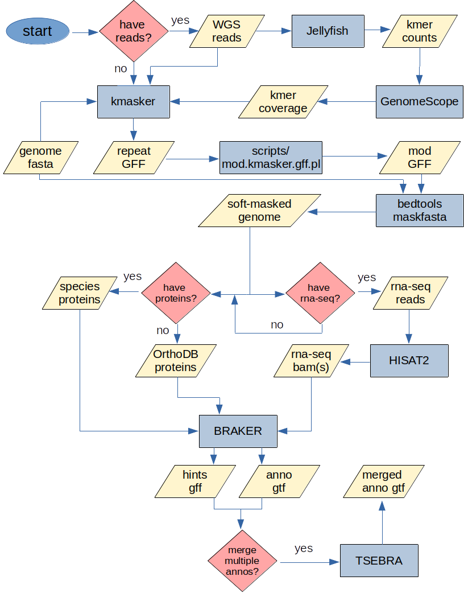

# kmer-masked annotation pipeline
annotation pipeline based on kmasker and BRAKER

below are some notes regarding various components of the pipeline

# kmasker
- kmasker masks sequences using either genome or read-based kmer frequencies. Using reads is preferred as genome assemblers can collapse repeats into a single copy, which kmasker won't detect using genome-based kmer frequencies.
- The default kmasker frequency threshold is 10, though we've found 5 will also produce good results without over-masking. kmasker results produced with a frequency threshold of 5 were found to be less aggressively masked (approximately 50% fewer masked bases) than using RepeatModeler and RepeatMasker, with our data..

# GenomeScope
- If using reads, you'll need to determine the appropriate kmer frequency since read coverage will typically not equal 1x coverage. This is accomplished by following the Jellyfish and GenomeScope sub-pipeline to determine the GenomeScope "kcov" value.
- For diploids, be sure to set GenomeScope's ploidy option to '2'. In this case, kcov will represent the haploid kmer coverage, which should be doubled to represent the diploid kmer coverage. (If working with an inbred species, the haploid kcov should not be doubled.) It is recommended to check the GenomeScope plots to ensure the coverage curve and estimated haploid peak look reasonable.
- Finally, the diploid kmer coverage will need to be multiplied by the kmasker (genome) frequency threshold to obtain the adjusted frequency threshold for reads.

example: 
- reads have a haploid kcov = 7, the preferred genome frequency threshold = 5 and the ploidy = 2
- read-adjusted kmasker frequency threshold = haploid kcov * (effective) ploidy * preferred genome frequency threshold
- read-adjusted kmasker frequency threshold = 7 * 2 * 5
- read-adjusted kmasker frequency threshold = 70

# BRAKER
- BRAKER can be ran with either protein sequences and/or rna-seq, ideally both. (proteins and rna-seq should be processed by BRAKER individually and merged using TSEBRA)
- If you don't have (or have relatively few) closely-related protein sequences, BRAKER recommends using (or supplementing existing proteins with) OrthoDB proteins. (see BRAKER doc for full details) BRAKER was tested using ~300k closely-related proteins, ~3.5M OrthoDB Viridplantae proteins and the combined closely-related/OrthoDB set. In our tests, the closely-related protein set performed the best.

# TSEBRA
- If you have rna-seq in addition to protein-based BRAKER annotations (and hint files), you may choose to merge the two sets.

# software links
- [kmasker](https://github.com/tschmutzer/kmasker)
- [Jellyfish](https://github.com/gmarcais/Jellyfish)
- [GenomeScope](https://github.com/tbenavi1/genomescope2.0)
- [HISAT2](https://daehwankimlab.github.io/hisat2/)
- [BRAKER](https://github.com/Gaius-Augustus/BRAKER)
- [TSEBRA](https://github.com/Gaius-Augustus/TSEBRA)
